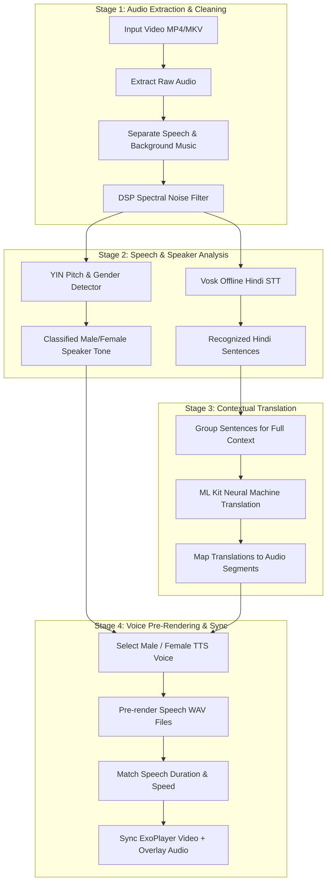

# Video Translator (LinguaPlay) 🎬💬

A native Android app built with Kotlin and Jetpack Compose that automatically translates speech in videos from **Hindi** into **English** and **Telugu** while keeping the speaker's male/female tone, matching speech timing, and preserving original background music.

---

## 🧭 How It Works (Step-by-Step Architecture)

The diagram below shows how a video flows through the 4 main stages of our translation pipeline:

---

## ⭐ Core Features

### 1. 🎵 Background Music Preservation
* **Keeps Original Reverb & Instrumental Track**: Extracts speech onto a separate mono channel while isolating the background music track so translated dialogue sounds like a professional dub.

### 2. 🧹 Smart DSP Spectral Noise Suppression
* **Removes Background Hiss & Room Noise**: Applies a 512-point Short-Time Fourier Transform (STFT) noise filter across quiet stretches to clean the audio before speech recognition and pitch analysis.

### 3. 🎙️ Per-Segment Gender Detection
* **Identifies Male vs. Female Voices**: Evaluates fundamental pitch ($F_0$) for each spoken sentence to select a matching deep male voice (`en-us-x-tpd` / `te-in-x-teg`) or female voice (`en-us-x-iob` / `te-in-x-tee`).
* **Multi-Pass Confidence Scoring**: If speech is short or quiet, the app expands the analysis window ($\pm 250\text{ ms}$) to make sure the tone detection is accurate.

### 4. 💬 Two-Tier Full-Sentence Translation
* **Natural Grammar & Flow**: Groups short phrase fragments into complete sentences before translating with Google ML Kit. This prevents choppy word-for-word translations while maintaining precise audio timing.

### 5. ⏱️ Lip-Sync & Duration Speed Matching
* **Keeps Dialogue In Sync**: Measures pre-rendered speech length and dynamically adjusts playback speed ($0.75\times$ to $1.5\times$) so translated sentences fit inside the original speaker's time window.

### 6. ⚡ 100% Offline & Instant Caching
* **No Internet Required**: Uses local Vosk STT models and ML Kit neural translation on device.
* **Instant Repeat Playback**: First run takes $\sim55-70$ seconds to process. Repeat plays and language switches are instant ($<50\text{ ms}$).

### 7. 🔔 In-App Voice Data Installer
* **One-Click Remediation**: If your device lacks specific Hindi, English, or Telugu voice packs, the app prompts you with a direct **Install Voice Data** button that opens system settings.

---

## ⚡ Performance & Processing Speed

| Run Type | Processing Time | Description |
|:---|:---:|:---|
| **First Video Load** | **`~55 – 70 sec`** | Performs audio separation, noise filtering, speech recognition, translation, pitch detection, and pre-rendering. |
| **Language Switch** | **`< 50 ms (Instant)`** | Swaps between English and Telugu immediately using cached pre-rendered WAV audio. |
| **Repeat App Launch** | **`< 50 ms (Instant)`** | Loads previously rendered video translation directly from local app storage. |

---

## 📱 Requirements & Compatibility

- **Operating System**: Android 8.0 (API Level 26) or higher.
- **Languages Supported**: Hindi (Source Speech) $\rightarrow$ English & Telugu (Target Dubbing).
- **TTS Engine**: Google Speech Services (pre-installed on most Android devices).

---

## 📂 Source Code & Repository

- **GitHub Repository**: [SyedSaad8008/Video-Translator](https://github.com/SyedSaad8008/Video-Translator)
- **License**: MIT
