# Video Translator (LinguaPlay) 🎬💬

A native Android application that automatically translates Hindi video dialogue into **English** and **Telugu** while preserving the speaker's male/female voice tone, matching speech timing, and keeping the original background music track intact.

---

## 🧭 Visual System Architecture

Here is how a video is processed from raw input to fully dubbed output:

```mermaid
flowchart LR
    %% Inputs
    VIDEO["🎬 Input Video<br>(Hindi Speech + Music)"]

    %% Phase 1: Audio Processing
    subgraph P1 ["1️⃣ Audio Extraction & Filtering"]
        direction TB
        EXTRACT["🔊 Separate Audio Tracks"]
        MUSIC["🎵 Preserved Music Track"]
        SPEECH["🎙️ Raw Speech PCM"]
        NOISE["🧹 DSP Spectral Noise Filter"]

        EXTRACT --> MUSIC
        EXTRACT --> SPEECH
        SPEECH --> NOISE
    end

    %% Phase 2: AI Speech & Pitch Analysis
    subgraph P2 ["2️⃣ AI Speech & Tone Analysis"]
        direction TB
        STT["🗣️ Vosk Offline STT<br>(Recognizes Hindi Words)"]
        PITCH["📊 YIN Pitch Detector<br>(Male vs Female F0 Tone)"]
    end

    %% Phase 3: Smart Translation
    subgraph P3 ["3️⃣ Neural Translation"]
        direction TB
        CLUSTER["🧩 Full-Sentence Grouping<br>(Contextual Grammar)"]
        TRANSLATE["🤖 ML Kit Engine<br>(Translates to EN & TE)"]

        CLUSTER --> TRANSLATE
    end

    %% Phase 4: Voice Synthesis & Video Playback
    subgraph P4 ["4️⃣ Dubbed Audio & Video Sync"]
        direction TB
        VOICE["🎭 Select TTS Voice<br>(Male or Female Match)"]
        TTS["🔊 Pre-Render Speech WAV"]
        SPEED["⏱️ Lip-Sync Speed Match<br>(0.75x to 1.5x)"]
        PLAYBACK["▶️ ExoPlayer Sync<br>(Dubbed Voice + Music)"]

        VOICE --> TTS
        TTS --> SPEED
        SPEED --> PLAYBACK
    end

    %% Main Pipeline Flow
    VIDEO --> EXTRACT
    NOISE --> STT
    NOISE --> PITCH
    STT --> CLUSTER
    TRANSLATE --> VOICE
    PITCH --> VOICE
    MUSIC ==> PLAYBACK
```

---

## 💡 How Each Phase Works

### 1️⃣ Audio Extraction & Cleaning
- **Background Music Preservation**: Splits speech dialogue from background music so original soundtracks and sound effects are retained in the final video.
- **DSP Noise Filtering**: Uses a 512-point Short-Time Fourier Transform (STFT) spectral noise filter to remove room noise and background hiss before recognition.

### 2️⃣ Speech Recognition & Speaker Pitch Analysis
- **High-Precision Offline STT**: Uses the Vosk Hindi acoustic model to transcribe spoken words locally without internet.
- **Pitch-Based Gender Detection**: Uses YIN normalized autocorrelation to measure fundamental vocal pitch ($F_0$), identifying whether the speaker is Male ($<165\text{ Hz}$) or Female ($\ge165\text{ Hz}$).

### 3️⃣ Two-Tier Sentence Translation
- **Full-Sentence Grammar Context**: Groups short phrase fragments into complete sentences before passing them to Google ML Kit, producing natural English and Telugu translations instead of choppy word-by-word dubs.
- **Proportional Audio Mapping**: Maps translated full-sentence words back to precise audio time windows to preserve video sync.

### 4️⃣ Gender-Matched Voice Synthesis & Timing Sync
- **Gender-Matched Voice Selection**: Dubs male speakers with deep male voices (`en-us-x-tpd` / `te-in-x-teg`) and female speakers with clear female voices (`en-us-x-iob` / `te-in-x-tee`).
- **Dynamic Lip-Sync Matching**: Adjusts speech playback speed ($0.75\times$ to $1.5\times$) so translated sentences complete at the exact moment the speaker finishes talking.
- **Instant Caching**: First run takes $\sim55-70$ seconds. Repeat plays and language switches are instant ($<50\text{ ms}$).

---

## ⚡ Performance Summary

| Action | Execution Time | Note |
|:---|:---:---|:---|
| **First Video Load** | **`~55 – 70 seconds`** | Full extraction, noise filtering, AI translation, pitch analysis, and TTS pre-rendering. |
| **Language Switch** | **`< 50 ms (Instant)`** | Swaps between English and Telugu instantly using local pre-rendered audio cache. |
| **Re-opening App** | **`< 50 ms (Instant)`** | Loads previously translated video sessions directly from storage. |

---

## 📱 System Requirements

- **Android Version**: Android 8.0 (API Level 26) or higher.
- **Supported Languages**: Hindi (Source Audio) $\rightarrow$ English & Telugu (Target Dubs).
- **TTS Engine**: Google Speech Services (pre-installed on standard Android devices).

---

## 📂 Source Code & Repository

- **GitHub Repository**: [SyedSaad8008/Video-Translator](https://github.com/SyedSaad8008/Video-Translator)
- **License**: MIT
