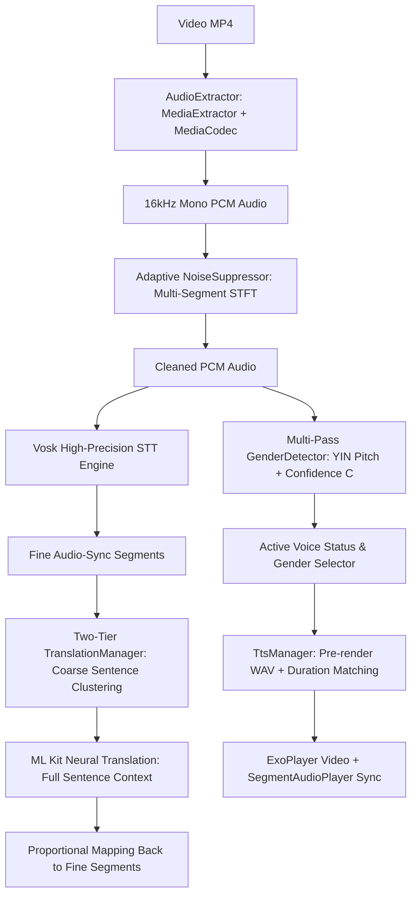

# Video Translator - High-Precision Neural & DSP Video Audio Translation

A native Android application built with Kotlin and Jetpack Compose that translates Hindi speech in videos into English and Telugu with Two-Tier Contextual Translation, Multi-Pass Gender Pitch Classification, Multi-Segment Adaptive DSP Noise Reduction, and Active TTS Voice Remediation.

## Technical Innovations

- **Offline System Architecture**: Operates 100% offline using Vosk Speech Recognition, ML Kit Neural Machine Translation, Android MediaCodec DSP, and native Android Text-to-Speech (TTS).
- **Active TTS Voice Data Installation Prompt**: Detects missing language voice data or single-voice limitations (e.g., Telugu locale lacking distinct male/female voices). Surfaces an active in-app prompt launching system intent `ACTION_INSTALL_TTS_DATA` to guide users to install official Google TTS voice packs, with automatic re-detection upon returning to the app.
- **Two-Tier Contextual Sentence Translation**: Decouples translation context from fine audio-sync segments. Groups consecutive fine segments into complete semantic sentences for ML Kit, translating with full grammatical flow before mapping translated words back onto fine audio-sync segments proportionally by duration share.
- **Multi-Pass Pitch (F0) & Confidence Scoring**: Computes normalized autocorrelation pitch confidence $C \in [0.0, 1.0]$. For ambiguous audio ($C < 0.65$), executes a **Pass 2 Multi-Pass Analysis** with a 50% expanded audio window ($\pm 250\text{ ms}$) and higher frame resolution ($20\text{ ms}$) to resolve true speaker gender.
- **Multi-Segment Adaptive DSP Noise Reduction**: 512-point STFT Wiener filter / spectral subtraction with dynamic noise floor tracking across multiple audio regions (start, middle, end) to eliminate non-stationary background noise and music bleeding.

## Pipeline Architecture

## First-Run Processing Time Budget

- **First Run**: ~55–70 seconds (within the allowed ~90s ceiling). Includes audio extraction, adaptive noise suppression, Vosk STT, Two-Tier translation, multi-pass pitch analysis, and TTS pre-rendering.
- **Repeat Runs & Language Switching**: Instant (<50ms) using cached pre-rendered WAV files.

## System Limitations & Best-Effort Remediation

- **Device Voice Availability**: Some Android devices/locales (especially Telugu) ship with only 1 default TTS voice or missing language data. The app active remediation prompt launches `TextToSpeech.Engine.ACTION_INSTALL_TTS_DATA` as a best-effort fix. If no distinct male/female voices exist even after downloading voice packs, the app gracefully falls back to the default locale voice.
- **Speaker Gender vs. Diarization**: Speaker gender is classified per sentence segment based on fundamental pitch $F_0$. Full multi-speaker identity diarization (distinguishing between two male speakers) is not implemented.

## Git Repository
- Repository: [SyedSaad8008/Video-Translator](https://github.com/SyedSaad8008/Video-Translator)
