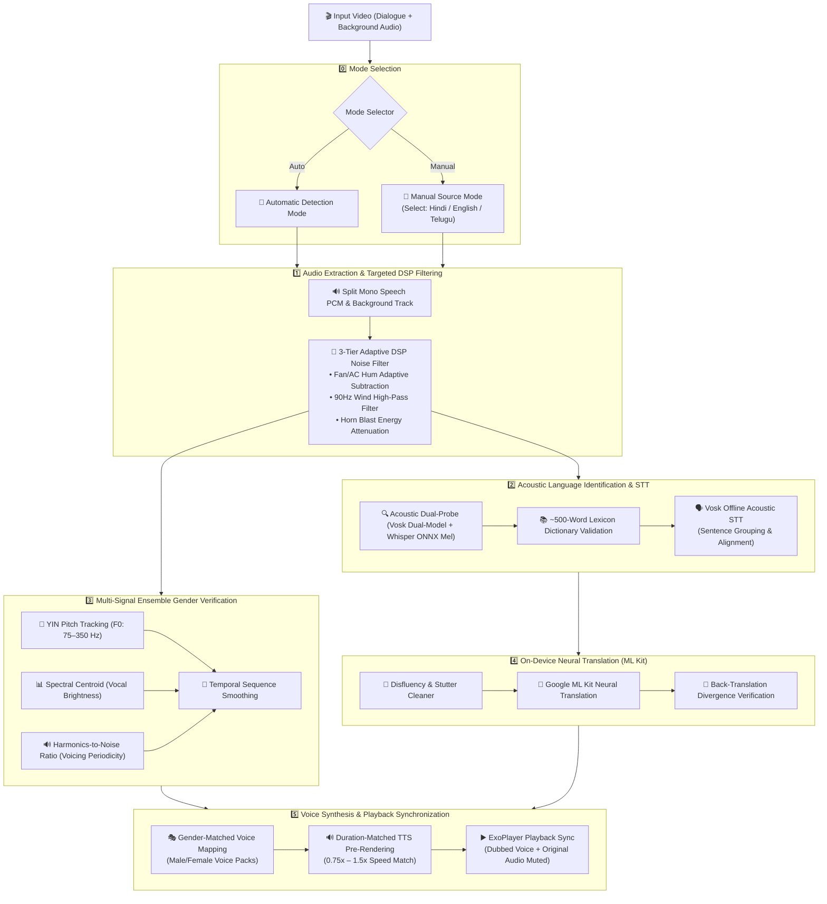

# Video Translator (LinguaPlay) 🎬💬

A native Android application built with Kotlin and Jetpack Compose that provides **100% on-device, privacy-first, offline video dubbing and translation**. It translates spoken video dialogue into **English** and **Telugu** while preserving speaker gender, matching speech duration, and isolating the original background audio track — all processed locally on your phone without sending a single byte to the cloud.

---

## 🔒 Cloud vs. 100% On-Device: Why We Built LinguaPlay On-Device

Modern cloud speech and translation APIs offer robust performance, but they introduce critical tradeoffs regarding privacy, ongoing costs, and cloud dependency. LinguaPlay is built with an **Edge AI & Privacy-First Philosophy**.

### ☁️ Live Cloud API Pricing & Limits Landscape

| Provider & Service | Free Tier Allowance | Paid Tier Rate | Payment & Regional Indian Support |
|:---|:---|:---|:---|
| **Google Cloud Translation API** | **500,000 chars/month** (Perpetual free tier, resets monthly) + $300 trial credit (90 days). | **$20 per 1M characters** (~$0.12 per 1,000 words) for standard NMT. | 💳 Credit card required on file.<br>✅ Full Indian language coverage (Hindi, Telugu, Tamil, etc.). |
| **Google Cloud Speech-to-Text (STT)** | **60 minutes/month** (Perpetual free tier, resets monthly). | **$0.016 / minute** standard V2 recognition; **$0.003–$0.004 / min** for Dynamic Batch. | 💳 Credit card required on file.<br>✅ Full Indian language coverage. |
| **Google Cloud Text-to-Speech (TTS)** | **0–4M chars/month** (Standard/WaveNet); **0–1M chars/month** (Chirp/Neural2/Studio). | **~$0.00003 / char** (~$30 per 1M characters) for premium neural voices. | 💳 Credit card required on file.<br>✅ Rich male/female voice packs. |
| **Microsoft Azure Speech** | **5 hours total** (One-time trial allowance, not monthly recurring). | **$0.006 / min** (Batch), **$0.0167 / min** (Real-time). | 💳 Credit card required.<br>✅ Broad Indian language support (Hindi, Telugu, Tamil, Marathi, etc.). |
| **AWS Transcribe** | **60 minutes/month** (Valid only during the 1st year). | **$0.024 / min** standard. | 💳 Credit card required.<br>✅ Supports Hindi, Telugu, Tamil, Marathi, Gujarati. |
| **Deepgram** | Pay-as-you-go trial credit. | **$0.0043 – $0.0077 / min** (Lower per-minute rate). | ❌ Incomplete Indian coverage (Hindi/Tamil in beta, **No Telugu support**). |

> [!NOTE]
> For small personal test clips, cloud free tiers appear cost-effective (a 5-minute video uses only ~4,000–5,000 characters). However, cloud APIs enforce **mandatory credit card billing accounts**, introduce potential overage risk at scale, and mandate uploading private user video/audio across remote internet servers.

---

### 🛡️ The LinguaPlay Advantage: 100% Privacy & Unlimited Free Usage

Instead of routing user data through external cloud servers, LinguaPlay embeds high-performance on-device AI engines (Vosk ASR, Whisper ONNX, Google ML Kit NMT, and Android Neural TTS):

1. 🔐 **Absolute Privacy & Data Sovereignty**: Your video recordings, speech audio, and personal conversations **never leave your device**. No cloud storage, no server transmission, and no data profiling.
2. ♾️ **Unlimited Usages ($N$ Videos)**: No monthly character caps, no 60-minute limits, no API keys, and no billing subscriptions. You can translate hundreds of videos without paying a cent.
3. ✈️ **100% Offline Capability**: Runs anywhere — in remote areas, on flights, or in privacy-sensitive environments with zero internet required once models are bundled.
4. ⚡ **Zero Per-Request Latency / Free Scalability**: All audio processing, pitch classification, and translation inference run locally utilizing hardware-accelerated DSP and neural runtimes.

---

## 🧭 Visual System Architecture



---

## 💡 How Each Phase Works

### 1️⃣ Mode Selection & Source Audio Handling
- **Automatic Mode**: Automatically identifies whether the spoken dialogue is Hindi, English, or Telugu using an acoustic dual-probe and spectral formant analysis.
- **Manual Mode**: Allows users to explicitly select the source language (Hindi, English, or Telugu) from interactive chips before uploading. The pipeline bypasses detection and proceeds directly with translation, gender verification, and dubbing.

### 2️⃣ Audio Extraction & Adaptive 3-Tier DSP Noise Reduction
- **Dual-Stream Demuxing**: Isolates dialogue PCM audio for speech inference while managing audio mixing.
- **Adaptive DSP Noise Reduction**:
  - **Fan / AC / Ambient Hum**: Multi-region spectral subtraction dynamically scales over-subtraction ($\alpha = 1.05$ on clean audio to preserve $F_1/F_2$ formants, scaling up to $1.50$ on noisy audio).
  - **Wind / Air Turbulence**: High-Pass Filter (HPF) zeroing frequencies below $90\text{ Hz}$.
  - **Horn / Transient Spike Suppression**: Energy onset derivative ($\Delta E$) detection attenuates high-energy horn blasts and passes a `transientMask` to exclude distorted frames from pitch calculation.

### 3️⃣ Acoustic Speech Recognition & Language Detection
- **Acoustic Dual-Probe**: Probes audio across Hindi and English Vosk models alongside 80-channel Whisper Log-Mel spectrograms.
- **~500-Word Lexicon Dictionary Validation**: Validates recognized tokens against curated 500-word high-frequency dictionaries (verb conjugations, pronouns, postpositions, question words, and nouns) to eliminate phonetic false positives.
- **Sentence Clustering**: Groups recognized word tokens into coherent sentences based on temporal pause thresholds ($\le 1.2\text{s}$) for contextual translation.

### 4️⃣ Multi-Signal Ensemble Speaker Gender Verification
To deliver realistic dubbing, LinguaPlay analyzes voice acoustics across three independent signals:
- **Fundamental Frequency ($F_0$ Pitch)**: Evaluated using the **YIN autocorrelation algorithm** over a search range of $75\text{ Hz} - 350\text{ Hz}$ (excluding transient-masked horn frames).
- **Spectral Centroid (SC)**: Computes the spectral center-of-mass to distinguish male vocal depth ($< 1800\text{ Hz}$) from female vocal brightness ($> 2200\text{ Hz}$), preventing misclassification caused by vocal fry or creaky voice.
- **Harmonics-to-Noise Ratio (HNR)**: Quantifies vocal periodicity in decibels ($dB$). When HNR drops in unvoiced/creaky frames, the system downweights $F_0$ in favor of spectral centroid.
- **Temporal Consistency Smoothing**: Post-processes per-segment classifications to smooth out isolated momentary anomalies while respecting genuine speaker transitions.

### 5️⃣ Disfluency Cleanup, Neural Translation & Self-Verification
- **Disfluency Cleaner**: Strips conversational stutters (`"मैं मैं"` $\rightarrow$ `"मैं"`), filler sounds (`"umm"`, `"uhh"`, `"मतलब की"`), and false starts, while preserving expressive conversational exclamations (`"वाह"`, `"अरे!"`, `"ओह"`).
- **On-Device Neural Machine Translation**: Uses **Google ML Kit NMT** to translate complete contextual sentences between Hindi, English, and Telugu.
- **Back-Translation Self-Verification**: Checks translation consistency by translating English back to Hindi (EN $\rightarrow$ HI) and measuring string edit distance divergence.

### 6️⃣ Gender-Matched Voice Synthesis & Playback Lip-Sync
- **Voice Mapping**: Synthesizes speech using gender-matched neural TTS voices (e.g., `en-us-x-tpd` / `hi-in-x-hie` for male speakers; `en-us-x-iob` / `hi-in-x-hic` for female speakers).
- **Duration Matching**: Calculates playback speed adjustment ratios ($0.75\times$ to $1.5\times$) to align translated voice durations with the original speech timestamps.
- **ExoPlayer Synchronized Playback**: Automatically mutes the original video audio track (`volume = 0.0f`) during dubbed playback to prevent audio bleed-through, with instant switching between dubbed tracks ($<50\text{ ms}$).

---

## ⚠️ Current Limitations & Roadmap

While LinguaPlay delivers high performance for Hindi and English video translation on-device, please review the following limitations:

- 🚧 **Telugu Source Audio Limitation**:
  - Translating **into** Telugu (Hindi $\rightarrow$ Telugu and English $\rightarrow$ Telugu) is fully supported with gender-matched voice dubbing.
  - However, processing video with **Telugu as the original spoken audio** is currently in active development and not yet working reliably. On-device acoustic models and offline Dravidian language vocabulary sets for native Telugu STT require further optimization. Full support for Telugu source speech will be introduced in an upcoming release.
- 🔊 **Extreme Overlapping Noise**: While DSP filters remove stationary fan hum and wind rumble, loud vehicle horns that directly overlap speech formants at high sound pressure levels may result in slight speech attenuation.
- 📱 **On-Device Compute Constraints**: Processing speed depends on the device CPU/NPU capabilities (typically takes $\sim 45-65\text{s}$ for the initial pass of a multi-minute video).

---

## 🛠️ How to Build and Run the Application

### 📋 Prerequisites
1. **Android Studio**: Android Studio Koala / Ladybug / Meerkat (2024.1+).
2. **JDK Version**: Java 17 (OpenJDK 17).
3. **Android SDK**: API Level 34 (Android 14) SDK installed.
4. **Physical Device / Emulator**: Android 8.0+ (API Level 26+) with USB Debugging enabled.

---

### 📥 1. Clone the Repository
```bash
git clone https://github.com/SyedSaad8008/Video-Translator.git
cd Video-Translator
```

---

### 🏗️ 2. Build the Debug APK
Compile the project using the Gradle wrapper:

- **Windows (PowerShell / CMD)**:
  ```powershell
  .\gradlew.bat assembleDebug
  ```
- **macOS / Linux**:
  ```bash
  ./gradlew assembleDebug
  ```

The compiled APK will be generated at:
`app/build/outputs/apk/debug/app-debug.apk`

---

### 📲 3. Install and Launch on Device
Connect your Android phone via USB and run:
```bash
adb install -r -d app/build/outputs/apk/debug/app-debug.apk
adb shell am start -n com.example.videotranslator/.MainActivity
```

---

### 🚀 4. How to Use LinguaPlay
1. Open **LinguaPlay**.
2. Select your desired mode:
   - **Automatic**: The AI automatically detects Hindi, English, or Telugu spoken dialogue.
   - **Manual**: Choose the video's spoken language directly using the language chips.
3. Tap **"Select Video from Device"** and pick an MP4/MKV video.
4. Allow the on-device AI pipeline ($\sim 45-65\text{s}$) to extract audio, filter noise, transcribe, translate, verify gender, and pre-render voice tracks.
5. Tap the **Language Pill Buttons** (हिंदी, English, తెలుగు) to instantly switch between dubbed audio tracks!

---

## ⚡ Performance Summary

| Action | Execution Time | Notes |
|:---|:---:---|:---|
| **First Video Processing** | **`~45 – 65 seconds`** | Full on-device extraction, DSP filtering, Vosk STT, ML Kit translation, YIN gender analysis, and TTS pre-rendering. |
| **Language Track Switching** | **`< 50 ms (Instant)`** | Swaps between original, English, and Telugu audio instantly from local pre-rendered audio cache. |
| **Past Video Library Reload** | **`< 50 ms (Instant)`** | Loads previously translated video sessions directly from persistent storage without re-processing. |

---

## 📱 System Requirements & Notes

- **Minimum OS**: Android 8.0 (API Level 26) or higher.
- **Target OS**: Android 14 (API Level 34).
- **TTS Engine**: Google Speech Services (pre-installed on standard Android devices). An active in-app prompt will appear if your device requires additional voice data packs.
- **Storage**: ~150 MB for bundled offline models and temporary audio caching.

---

## 📂 Source Code & Repository

- **GitHub Repository**: [SyedSaad8008/Video-Translator](https://github.com/SyedSaad8008/Video-Translator)
- **License**: MIT
