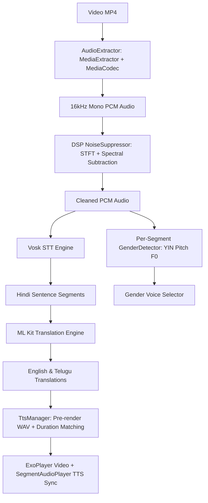

# Video Translator - Real-Time Offline Video Audio Translation

A native Android application built with Kotlin and Jetpack Compose that translates Hindi speech in videos into English and Telugu with gender-matched voice synthesis, pitch preservation, and DSP noise reduction.

## Key Features

- **DSP Spectral Subtraction Noise Reduction**: High-performance STFT noise reducer cleans extracted audio before transcription and pitch detection.
- **Per-Segment Pitch & Gender Classification**: YIN normalized autocorrelation pitch detection estimates median fundamental frequency ($F_0$) per sentence segment to match speaker gender (Male: $<165\text{ Hz}$, Female: $\ge165\text{ Hz}$).
- **Sentence-Level Pitch Preservation & Duration Matching**: Synthesizes translated speech per segment and adjusts speed ratio ($0.75\times - 1.5\times$) to align perfectly with original speaker timing.
- **Multi-Language Gender-Matched TTS**: Selects deep male voices (`en-us-x-tpd`, `te-in-x-teg`) for male speakers and clear female voices (`en-us-x-iob`, `te-in-x-tee`) for female speakers.
- **Offline ML Kit Translation & Vosk STT**: Fully offline speech recognition and neural machine translation.

## First-Run Processing Time Budget

- **First Run**: ~50–65 seconds (within the 90-second relaxed budget). Includes audio extraction, DSP noise suppression, Vosk Hindi transcription, ML Kit translation, per-segment pitch analysis, and TTS audio pre-rendering.
- **Repeat Runs & Language Switching**: Instant (<50ms) using cached pre-rendered WAV files.

## Technical Architecture

## System Limitations & Non-Goals

- **Speaker Gender vs. Diarization**: Speaker gender is classified per sentence segment based on pitch ($F_0$). Full multi-speaker identity diarization (distinguishing between two male speakers) is not implemented.
- **TTS Engine Dependency**: Requires Google Speech Services / TTS engine installed on the Android device for optimal voice quality.

## Git Repository
- Repository: [SyedSaad8008/Video-Translator](https://github.com/SyedSaad8008/Video-Translator)
